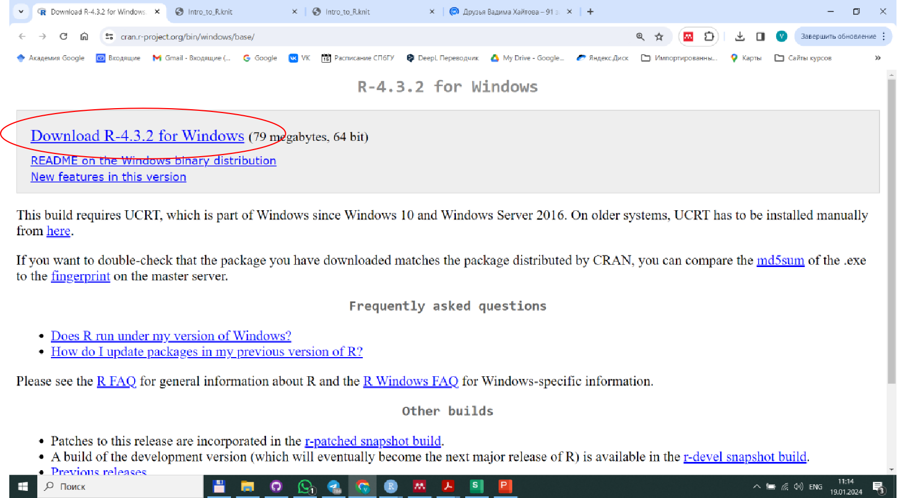
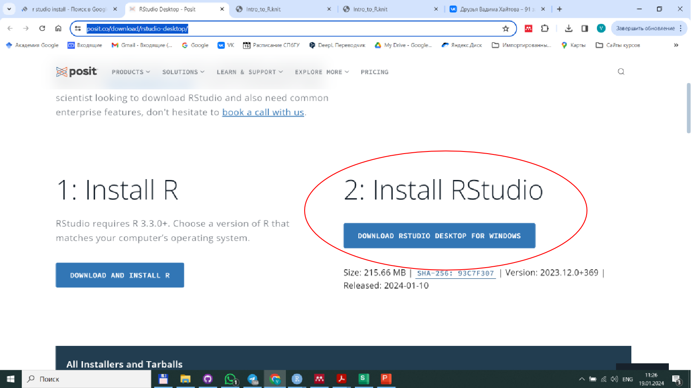

```{r setup, include=FALSE}
knitr::opts_chunk$set(echo = TRUE)
```

## Первые действия 

#### 1. Установите на свой компьютер язык *R*. 

<br>

Ссылка для скачивания пакета устновки языка *R*: https://cran.r-project.org/bin/windows/base/

<br>




<br>
<br>


После скачивания, запустите загруженный файл **"R-4.3.2-win.exe"** и следуйте указаниям установочной программы. 
 

<br>
<br>


#### 2. После установки языка *R*, установите прорамму *R Studio*

<br>

Ссылка для скачивания: https://posit.co/download/rstudio-desktop/

<br>



