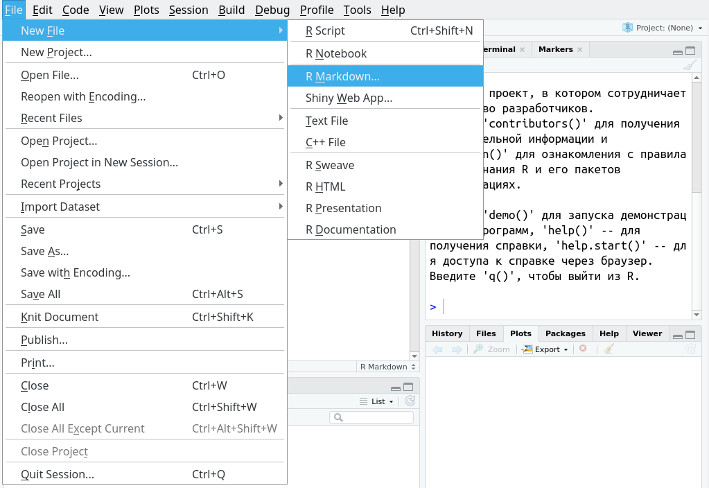
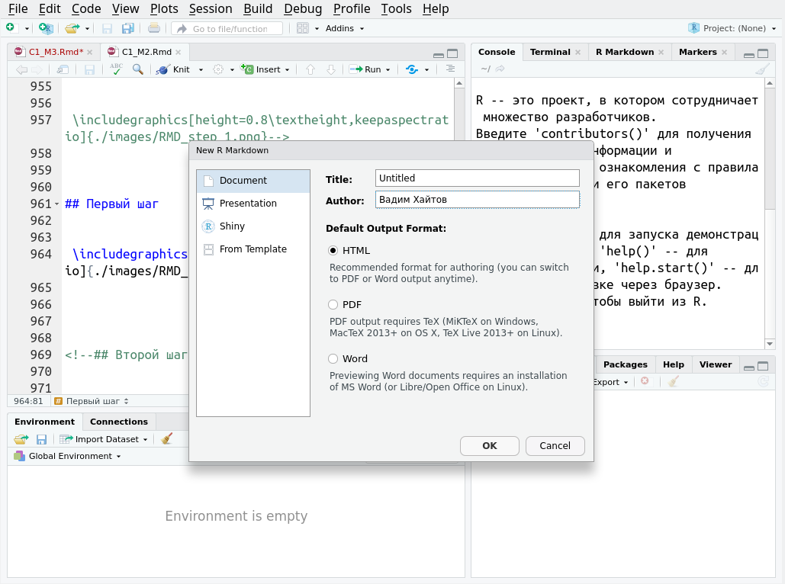
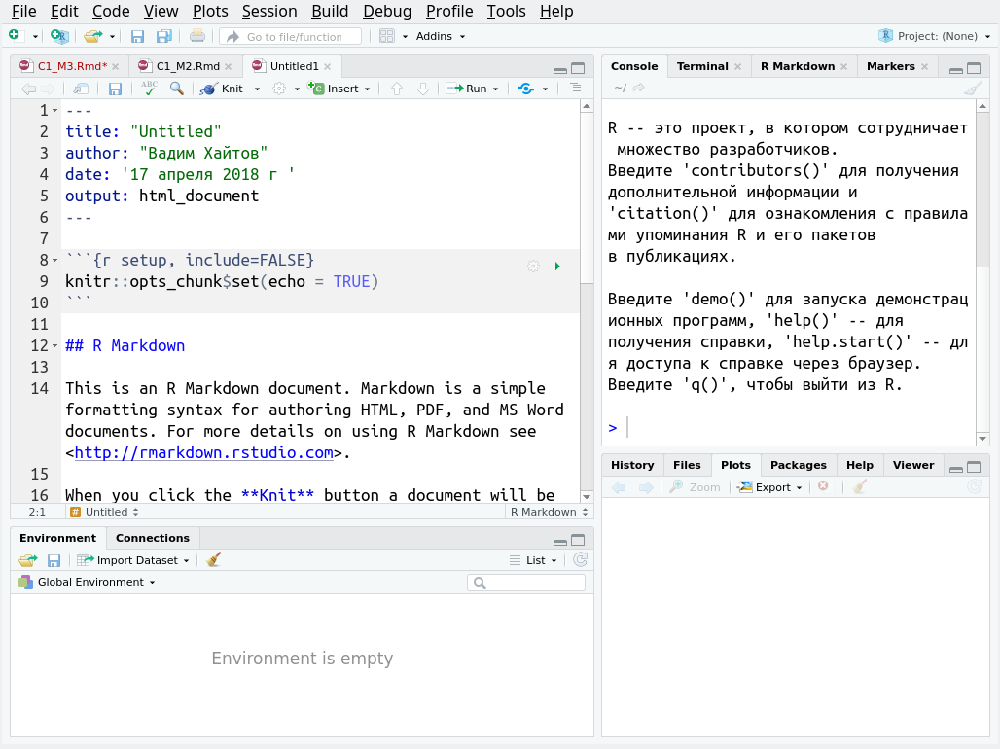
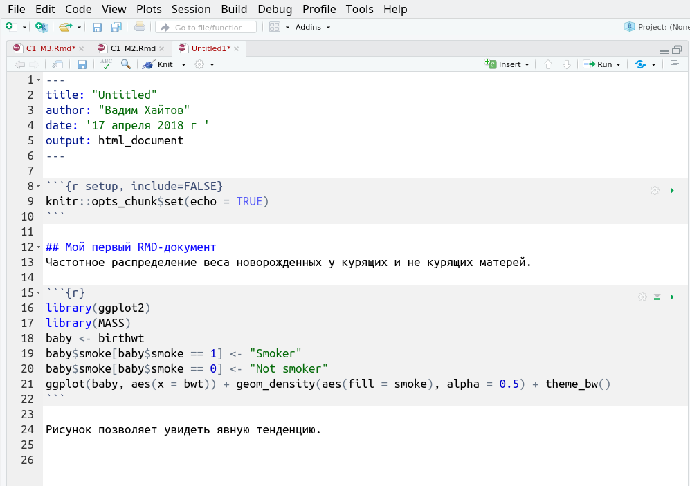
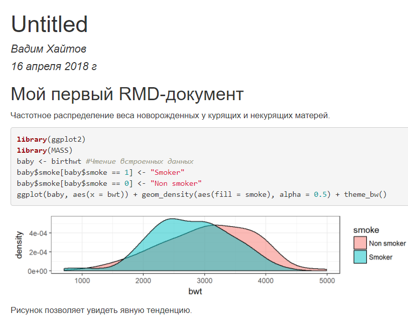
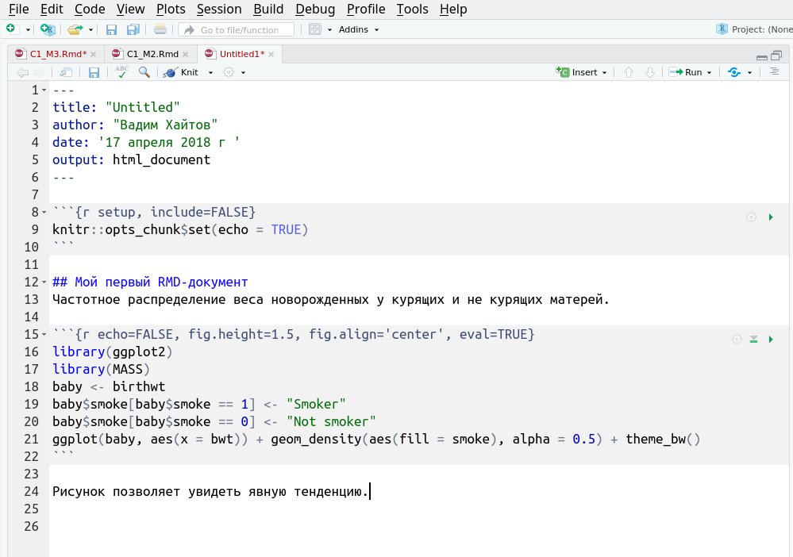
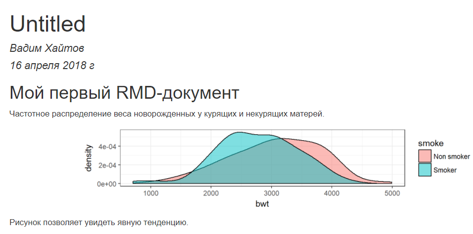
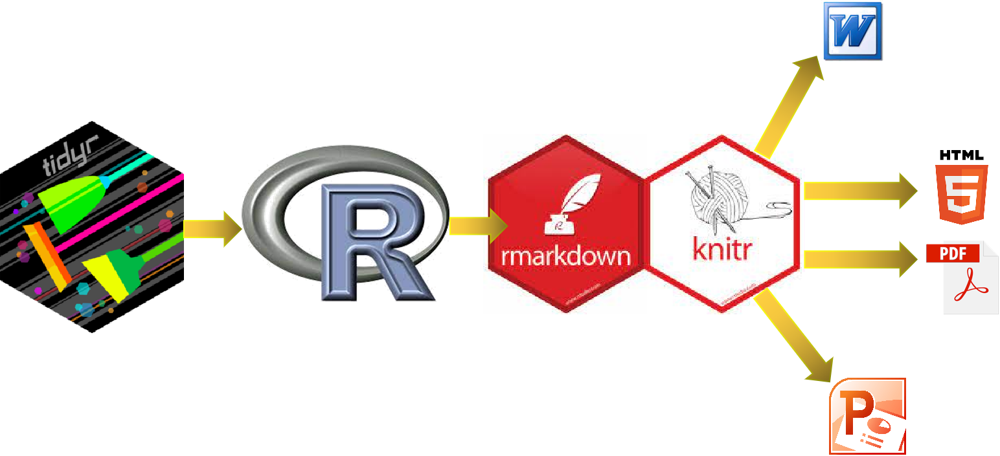

```{r setup, include=FALSE, cache=FALSE, purl=FALSE}
# output options
options(width = 70, scipen = 6, digits = 3)
library (knitr)
library (scales)
# chunk default options
opts_chunk$set(fig.show='hold', size='footnotesize', comment='#', 
               fig.width=4.5, out.width='3in',
               fig.height=2.25, out.height='1.5in',
               cache=FALSE,
               warning=FALSE, message=FALSE)
# Тема для иллюстраций
library (ggplot2)
library (gridExtra)
```


## Для исполнителей {.columns-2}

{width=60%}


Вы создали презентацию, написали текст статьи или отчета.

Начальнику не понравилась форма графиков, цвет заливки, величина шрифта и т. п...

В дополнение коллеги принеcли вам исправленные файлы с первичными данными...

Все документы надо срочно переделывать...

Выход из этого кошмара --- создание RMD-документа.


## Для пользователей разных платформ {.columns-2}

{width=60%}

Ваши коллеги работают под Linux и Windows, а вы предпочитаете Mac OS.

Продукт вашего совместного творчества должен читаться на любом компьютере. 

Основа плодотворного сотрудничества --- работа с RMD-документами.


## Для исследователей {.columns-2} 

{width=60%}


Вы ученый-иследователь. 

В статьях, которые вы читаете, видна лишь вершина айсберга: характер данных, процедуры анализа, способ построения таблиц и графиков остаются в тени.

Вас не оставляет чувство сомнения в правоте автора статьи, так как нет возможности воспроизвести  те действия с данными, которые произвел автор.

Выход из этого --- стать сторонником идеи **Reproducible research** 


## Reproducible research

Воспроизводимое исследование --- это анализ, который может быть воспроизведен на основе тех же данных любым другим исследователем. 

Воспроизводимое исследование не надо путать с воспроизводимостью результатов!


## Reproducible research

**Критерии воспроизводимого исследования**

- Исходные данные (raw data) доступны любому читателю-потребителю (в идеале, публично доступны).
- Все методы анализа полностью описаны.
- Весь процесс анализа исходных данных (от чтения данных до финального результата) полностью описан и сохранен в виде некоторого текста (кода анализа).

Лучшее средство для представления своих результатов как воспроизводимого исследования --- это создание RMD-документов. 


## R Markdown

{width=60%}

RMD-документы --- это документы, созданные с использованием языка разметки R Markdown.


## Документ или презентация




## Внешний вид RMD-документа



## Создание итогового документа

Текст RMD-документа передается функции `knit()` из пакета `knitr`.

Эта функция создает итоговый документ в том формате, который указан в заголовке RMD-документа (html, pdf, docx).

## Чанки {.columns-2}

{width=100%}

Чанк --- это исполняемый код, встроенный в текст.

Вставка чанка в RStudio: Ctrl+Alt+I


## Пример RMD-документа

{width=80%}


## Результат работы `knitr` в окне браузера 

{width=75%}


## Параметры чанков




## Результат работы `knitr` с новыми параметрами чанка

{width=80%}


## Наиболее важные параметры чанка


- `echo` --- Приводить ли код из чанка в документе, который получится в результате работы `knitr`
- `eval` --- Запускать ли код, приведенный в чанке
- `fig.` --- Набор параметров для регуляции положения и размера рисунков
- `warning` --- Выводить ли в итоговый документ предупреждающие сообщения функций


## Непрерывная последовательность от данных к итоговому документу

{width=80%}


