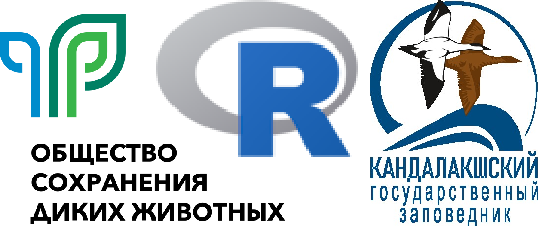
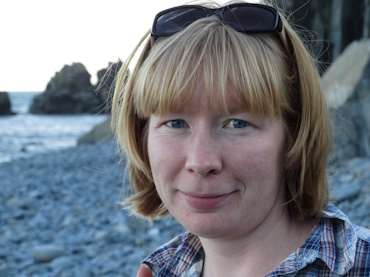
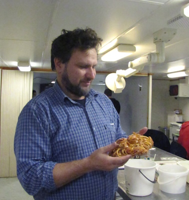

```{r echo=FALSE, include=FALSE}
library(knitr)
opts_chunk$set(echo = FALSE, message = FALSE)
```


```{r, echo=FALSE,out.width="40%",fig.cap = " ", fig.show='hold',fig.align='center'}





```


## О семинаре

R – ведущая статистическая программа для анализа данных на сегодняшний день, визуализация данных, моделирование и работы с GIS. Её главное достоинство – после освоения базовых принципов R намного проще в использовании, чем другие инструменты. Программа R удобна для работы с большим массивом данных, их объединение из разных таблиц, проводить разнообразные манипуляции над данными. В рамках семинара вы получите начальные знания о работе программы R: писать скрипты, загружать таблицы и пакеты, простым манипуляциям над данными и таблицам, строить простые и более сложные графики, находить в интернете необходимую информации.


Для успешного прохождения курса, Вы должны понимать, что примерно 20% времени семинара составляют лекции, и **80%– самостоятельные занятия: выполнение домашнего задания + освоение материала**. В конце участники работают со своими данными – индивидуальные проекты, чтобы закрепить полученные знания наилучшим образом.
Занятия бесплатные. По окончании всем участникам семинара, защитившим *индивидуальный проект*, выдается сертификат с указанием наименования курса и количества часов.

Внимание! Курс насыщенный и сложный! Если Вы в программе R новичок, учтите, что курс потребует от Вас существенных временных затрат. Возможно, Вам поможет прохождение вот [этого бесплатного русскоязычного курса](https://stepik.org/course/129/promo#toc). 

<br>
<br>


## Организации 

- [**Общество сохранения диких животных**](https://anowcs.ru/)

- [**Кандалакшский государственный заповедник**](https://kandalaksha-reserve.ru/)

<br>
<br>


## Инструкторы

<!--    -->

<!-- <br> -->
<!-- <br> -->

<!--  -->


```{r}
library(ggplot2)
library(cowplot)
library(magick)
library(ggtext)

photo <-  ggdraw() + 
  draw_image("Figures/Anna.jpg") 
  
df <- data.frame(
  label = "**Анна Сергеевна Мухачева** <br> email: siam83__mail.ru. <br> Kоординатор полевых проектов АНО «Общества сохранения диких животных». Восемь лет работала научным сотрудником в «Сихотэ-Алинском заповеднике». С 2022 года проводит семинары по основам статистике и программе R. Научная сфера: изучение амурского горала в Приморском крае. Интересы: экотуризм, бердвотчинг, экоинформационная работа с детьми.",
  x = c(0),
  y = c(1),
  hjust = c(0),
  vjust = c(1),
  orientation = c("upright"),
  color = c("black"),
  fill = c("cornsilk")
)

gg_text <-
  ggplot() +
  geom_textbox(data = df, aes(x, y, label = label,  orientation = orientation), width = unit(0.9, "npc"), color = "black", fill = "white", hjust = 0.5, vjust = 0.5) +
  theme_nothing()
  
  
# plot_grid(photo, gg_text)

```

```{r}
photo_2 <- ggdraw() + draw_image("Figures/Vadim.jpg")

df <- data.frame(
  label = "**Хайтов Вадим Михайлович**  <br> email: polydora__rambler.ru <br> Кандидат биологических наук, ведущий научный сотрудник Кандалакского государственного заповедника, преподаватель Санкт-Петербургского Государственного ниверситета, педагог дополнительного образования Санкт-Петербргского Городского Дворца Творчества Юных. Научная сфера: морская биология, биостатистика, научное образование школьников." ,
  x = c(0),
  y = c(1),
  hjust = c(0),
  vjust = c(1),
  orientation = c("upright"),
  color = c("black"),
  fill = c("cornsilk")
)

gg_text_2 <-
  ggplot() +
  geom_textbox(data = df, aes(x, y, label = label,  orientation = orientation), width = unit(0.9, "npc"), color = "black", fill = "white", hjust = 0.5, vjust = 0.5) +
  theme_nothing()
  
  
plot_grid(photo, gg_text, photo_2, gg_text_2, ncol = 2, rel_widths = c(0.5, 1, 1, 1))
```


